```mermaid
graph TB
    %% Actors
    GU[Guest User]
    RU[Regular User<br/>ROLE_USER]
    AD[Administrator<br/>ROLE_ADMIN]
    
    %% External Systems
    OAuth[OAuth Provider<br/>Google/GitHub]
    Email[Email Service]
    
    %% System Boundary
    subgraph "Smart Contact Manager System"
        %% Authentication
        UC001[Register Account]
        UC002[Login to System]
        UC003[Verify Email]
        UC004[OAuth Login]
        
        %% Profile Management
        UC005[View Profile]
        UC006[Update Profile]
        
        %% Contact Management
        UC007[Add Contact]
        UC008[View Contacts]
        UC009[Update Contact]
        UC010[Delete Contact]
        UC011[Search Contacts]
        UC012[Export Contacts]
        UC013[Mark as Favorite]
        
        %% Communication
        UC014[Direct Message]
        
        %% File Management
        UC020[Upload Contact Image]
        UC021[Manage Contact Photos]
        
        %% Admin Functions
        UC015[View Admin Dashboard]
        UC016[View All Users]
        UC017[View User Contacts]
        UC018[Monitor Statistics]
        UC019[Manage User Accounts]
    end
    
    %% Guest User Connections
    GU --> UC001
    GU --> UC002
    
    %% Regular User Connections
    RU --> UC002
    RU --> UC005
    RU --> UC006
    RU --> UC007
    RU --> UC008
    RU --> UC009
    RU --> UC010
    RU --> UC011
    RU --> UC012
    RU --> UC013
    RU --> UC014
    RU --> UC020
    RU --> UC021
    
    %% Administrator Connections (inherits all user functions plus admin functions)
    AD --> UC002
    AD --> UC005
    AD --> UC006
    AD --> UC007
    AD --> UC008
    AD --> UC009
    AD --> UC010
    AD --> UC011
    AD --> UC012
    AD --> UC013
    AD --> UC014
    AD --> UC015
    AD --> UC016
    AD --> UC017
    AD --> UC018
    AD --> UC019
    
    %% External System Connections
    UC004 -.-> OAuth
    UC003 -.-> Email
    UC001 -.-> Email
    
    %% Include Relationships
    UC002 -.-> UC003
    UC007 -.-> UC020
    UC009 -.-> UC021
    
    %% Styling
    classDef actor fill:#E8F4FD,stroke:#2563EB,stroke-width:2px
    classDef usecase fill:#F0F9FF,stroke:#0EA5E9,stroke-width:1px
    classDef external fill:#FEF3C7,stroke:#F59E0B,stroke-width:2px
    classDef admin fill:#FDF2F8,stroke:#EC4899,stroke-width:2px
    
    class GU,RU,AD actor
    class UC001,UC002,UC003,UC004,UC005,UC006,UC007,UC008,UC009,UC010,UC011,UC012,UC013,UC014,UC015,UC016,UC017,UC018,UC019,UC020,UC021 usecase
    class OAuth,Email external
    class UC015,UC016,UC017,UC018,UC019 admin
```

## Use Case Summary by Actor

### 🔓 Guest User (Unregistered)
- Register new account
- Login to system
- View public pages (home, about, services)

### 👤 Regular User (ROLE_USER)
**Profile Management:**
- View personal profile
- Update profile information
- Upload profile picture

**Contact Management:**
- Add new contacts
- View contact list (paginated)
- Update existing contacts
- Delete contacts
- Search contacts by name/email/phone
- Mark contacts as favorites
- Export contacts to CSV/Excel
- Upload contact images
- Manage contact photos

**Communication:**
- Send direct messages to contacts
- View message history

### 👑 Administrator (ROLE_ADMIN)
**Inherits all Regular User capabilities, plus:**

**System Administration:**
- View admin dashboard with statistics
- Monitor total users count
- Monitor total contacts count
- Monitor active users count

**User Management:**
- View all registered users
- View user details (name, email, status)
- View any user's contact list
- Monitor user verification status
- View user roles and permissions

**System Monitoring:**
- Analyze system usage statistics
- Monitor user activity
- View system health metrics

## 🔄 Use Case Interactions

### Registration Flow
1. Guest → Register Account
2. System → Send Verification Email
3. User → Verify Email
4. User → Login to System

### Contact Management Flow
1. User → Login
2. User → Add/View/Update/Delete Contacts
3. User → Upload Contact Images
4. User → Search/Filter Contacts
5. User → Export Contact Data

### Admin Monitoring Flow
1. Admin → Login
2. Admin → View Dashboard
3. Admin → View All Users
4. Admin → View User Contacts
5. Admin → Monitor Statistics

## 🔐 Security Use Cases

### Authentication & Authorization
- JWT token-based authentication
- Role-based access control (RBAC)
- OAuth integration (Google, GitHub)
- Email verification
- Password encryption (BCrypt)

### Data Protection
- Input validation for all forms
- CSRF protection
- XSS prevention
- Secure file upload handling
- Database query protection

## 📊 System Statistics Tracked

### User Metrics
- Total registered users
- Active users (enabled accounts)
- Email verified users
- Phone verified users
- Users by registration method (Local/OAuth)

### Contact Metrics
- Total contacts in system
- Average contacts per user
- Contact creation trends
- Most active users by contact count

### System Health
- Login frequency
- Feature usage statistics
- Error rates
- Performance metrics
