# Smart Contact Manager - Activity Diagram

## 🔄 Activity Diagrams

### **1. User Registration Activity Diagram**

```mermaid
graph TD
    Start([🚀 Start]) --> Input[📝 Enter Registration Details]
    
    Input --> Validate{✅ Validate Input}
    Validate -->|Invalid| Error1[❌ Show Validation Errors]
    Error1 --> Input
    
    Validate -->|Valid| CheckEmail{📧 Check Email Exists}
    CheckEmail -->|Exists| Error2[❌ Email Already Registered]
    Error2 --> Input
    
    CheckEmail -->|Available| Hash[🔐 Hash Password]
    Hash --> Save[💾 Save User to Database]
    Save --> SendEmail[📧 Send Verification Email]
    
    SendEmail --> Success[✅ Registration Successful]
    Success --> End([🏁 End])
```

### **2. User Login Activity Diagram**

```mermaid
graph TD
    Start([🚀 Start]) --> LoginForm[📝 Enter Login Credentials]
    
    LoginForm --> ValidateInput{✅ Validate Input}
    ValidateInput -->|Invalid| Error1[❌ Show Input Errors]
    Error1 --> LoginForm
    
    ValidateInput -->|Valid| CheckUser{👤 User Exists?}
    CheckUser -->|No| Error2[❌ User Not Found]
    Error2 --> LoginForm
    
    CheckUser -->|Yes| CheckPassword{🔐 Password Correct?}
    CheckPassword -->|No| Error3[❌ Invalid Password]
    Error3 --> LoginForm
    
    CheckPassword -->|Yes| CheckEnabled{🔓 Account Enabled?}
    CheckEnabled -->|No| Error4[❌ Account Disabled]
    Error4 --> LoginForm
    
    CheckEnabled -->|Yes| GenerateJWT[🎫 Generate JWT Token]
    GenerateJWT --> SetSession[📋 Set User Session]
    SetSession --> Redirect[🔄 Redirect to Dashboard]
    Redirect --> End([🏁 End])
```

### **3. OAuth Login Activity Diagram**

```mermaid
graph TD
    Start([🚀 Start]) --> Choose[🔘 Choose OAuth Provider]
    
    Choose --> Redirect1[🔄 Redirect to OAuth Provider]
    Redirect1 --> Authorize[🔐 User Authorizes Application]
    
    Authorize --> Callback[📞 OAuth Callback Received]
    Callback --> GetToken[🎫 Get Access Token]
    GetToken --> GetProfile[👤 Fetch User Profile]
    
    GetProfile --> CheckUser{👤 User Exists?}
    CheckUser -->|No| CreateUser[➕ Create New User Account]
    CreateUser --> LinkOAuth[🔗 Link OAuth Account]
    
    CheckUser -->|Yes| UpdateProfile[🔄 Update Profile Info]
    
    LinkOAuth --> GenerateJWT[🎫 Generate JWT Token]
    UpdateProfile --> GenerateJWT
    
    GenerateJWT --> SetSession[📋 Set User Session]
    SetSession --> Redirect2[🔄 Redirect to Dashboard]
    Redirect2 --> End([🏁 End])
```

### **4. Contact Management Activity Diagram**

```mermaid
graph TD
    Start([🚀 Start]) --> Dashboard[📊 User Dashboard]
    
    Dashboard --> ChooseAction{🔘 Choose Action}
    
    %% Add Contact Flow
    ChooseAction -->|Add Contact| AddForm[📝 Fill Contact Form]
    AddForm --> ValidateContact{✅ Validate Contact Data}
    ValidateContact -->|Invalid| ErrorContact[❌ Show Validation Errors]
    ErrorContact --> AddForm
    
    ValidateContact -->|Valid| ImageCheck{🖼️ Image Uploaded?}
    ImageCheck -->|Yes| UploadImage[☁️ Upload to Cloudinary]
    UploadImage --> SaveContact[💾 Save Contact to DB]
    ImageCheck -->|No| SaveContact
    
    SaveContact --> SuccessAdd[✅ Contact Added Successfully]
    SuccessAdd --> Dashboard
    
    %% View Contacts Flow
    ChooseAction -->|View Contacts| LoadContacts[📋 Load User Contacts]
    LoadContacts --> Pagination{📄 Apply Pagination}
    Pagination --> DisplayList[📋 Display Contact List]
    
    DisplayList --> ContactAction{🔘 Select Contact Action}
    ContactAction -->|View Details| ShowModal[👁️ Show Contact Modal]
    ShowModal --> DisplayList
    
    ContactAction -->|Edit| EditForm[✏️ Edit Contact Form]
    EditForm --> UpdateContact[🔄 Update Contact Data]
    UpdateContact --> DisplayList
    
    ContactAction -->|Delete| ConfirmDelete{❓ Confirm Delete}
    ConfirmDelete -->|Yes| DeleteContact[🗑️ Delete from DB]
    DeleteContact --> DisplayList
    ConfirmDelete -->|No| DisplayList
    
    %% Search Flow
    ChooseAction -->|Search| SearchForm[🔍 Enter Search Criteria]
    SearchForm --> ExecuteSearch[🔍 Execute Search Query]
    ExecuteSearch --> SearchResults[📋 Display Search Results]
    SearchResults --> ContactAction
    
    %% Excel Import/Export Flow
    ChooseAction -->|Excel Operations| ExcelChoice{📊 Import or Export?}
    
    ExcelChoice -->|Import| UploadFile[📁 Upload Excel File]
    UploadFile --> ParseExcel[📊 Parse Excel Data]
    ParseExcel --> ValidateExcel{✅ Validate Excel Data}
    ValidateExcel -->|Invalid| ExcelError[❌ Show Validation Errors]
    ExcelError --> UploadFile
    
    ValidateExcel -->|Valid| ImportContacts[📥 Import Contacts to DB]
    ImportContacts --> ImportSuccess[✅ Import Successful]
    ImportSuccess --> Dashboard
    
    ExcelChoice -->|Export| ExportContacts[📤 Export Contacts to Excel]
    ExportContacts --> DownloadFile[💾 Download Excel File]
    DownloadFile --> Dashboard
    
    Dashboard --> Logout{🚪 Logout?}
    Logout -->|Yes| End([🏁 End])
    Logout -->|No| Dashboard
```

### **5. Notes Management Activity Diagram**

```mermaid
graph TD
    Start([🚀 Start]) --> NotesPage[📝 Notes Dashboard]
    
    NotesPage --> NotesAction{🔘 Choose Notes Action}
    
    %% Create Note Flow
    NotesAction -->|Create Note| CreateForm[📝 New Note Form]
    CreateForm --> FillNote[✏️ Fill Note Details]
    FillNote --> ValidateNote{✅ Validate Note Data}
    ValidateNote -->|Invalid| NoteError[❌ Show Validation Errors]
    NoteError --> FillNote
    
    ValidateNote -->|Valid| SaveNote[💾 Save Note to DB]
    SaveNote --> NoteSuccess[✅ Note Created Successfully]
    NoteSuccess --> NotesPage
    
    %% View Notes Flow
    NotesAction -->|View Notes| LoadNotes[📋 Load User Notes]
    LoadNotes --> FilterNotes{🔍 Apply Filters?}
    FilterNotes -->|Yes| ApplyFilter[🔍 Apply Category/Favorite Filter]
    ApplyFilter --> DisplayNotes[📋 Display Notes List]
    FilterNotes -->|No| DisplayNotes
    
    DisplayNotes --> NoteItemAction{🔘 Select Note Action}
    
    %% View Note Details
    NoteItemAction -->|View Details| ShowNote[👁️ Show Note Details]
    ShowNote --> DisplayNotes
    
    %% Edit Note
    NoteItemAction -->|Edit| EditNoteForm[✏️ Edit Note Form]
    EditNoteForm --> UpdateNote[🔄 Update Note Data]
    UpdateNote --> DisplayNotes
    
    %% Delete Note
    NoteItemAction -->|Delete| ConfirmDeleteNote{❓ Confirm Delete Note}
    ConfirmDeleteNote -->|Yes| DeleteNote[🗑️ Delete Note from DB]
    DeleteNote --> DisplayNotes
    ConfirmDeleteNote -->|No| DisplayNotes
    
    %% Toggle Favorite
    NoteItemAction -->|Toggle Favorite| UpdateFavorite[⭐ Update Favorite Status]
    UpdateFavorite --> DisplayNotes
    
    %% Search Notes
    NotesAction -->|Search Notes| SearchNotes[🔍 Enter Search Query]
    SearchNotes --> ExecuteNoteSearch[🔍 Search in Title/Content]
    ExecuteNoteSearch --> SearchNoteResults[📋 Display Search Results]
    SearchNoteResults --> NoteItemAction
    
    NotesPage --> BackToDashboard{🔙 Back to Dashboard?}
    BackToDashboard -->|Yes| Dashboard[📊 Main Dashboard]
    BackToDashboard -->|No| NotesPage
    Dashboard --> End([🏁 End])
```

### **6. Profile Management Activity Diagram**

```mermaid
graph TD
    Start([🚀 Start]) --> ProfilePage[👤 Profile Page]
    
    ProfilePage --> ProfileAction{🔘 Choose Profile Action}
    
    %% View Profile
    ProfileAction -->|View Profile| LoadProfile[📋 Load Profile Data]
    LoadProfile --> DisplayProfile[👁️ Display Profile Information]
    DisplayProfile --> ProfileAction
    
    %% Edit Profile
    ProfileAction -->|Edit Profile| EditMode[✏️ Enable Edit Mode]
    EditMode --> UpdateFields[📝 Update Profile Fields]
    UpdateFields --> ValidateProfile{✅ Validate Profile Data}
    ValidateProfile -->|Invalid| ProfileError[❌ Show Validation Errors]
    ProfileError --> UpdateFields
    
    ValidateProfile -->|Valid| SaveProfile[💾 Save Profile Changes]
    SaveProfile --> ProfileSuccess[✅ Profile Updated Successfully]
    ProfileSuccess --> LoadProfile
    
    %% Change Profile Picture
    ProfileAction -->|Change Picture| UploadPicture[🖼️ Upload Profile Picture]
    UploadPicture --> ValidateImage{✅ Validate Image}
    ValidateImage -->|Invalid| ImageError[❌ Invalid Image Format/Size]
    ImageError --> UploadPicture
    
    ValidateImage -->|Valid| CloudinaryUpload[☁️ Upload to Cloudinary]
    CloudinaryUpload --> UpdatePictureUrl[🔄 Update Profile Picture URL]
    UpdatePictureUrl --> ProfileSuccess
    
    %% Change Password
    ProfileAction -->|Change Password| PasswordForm[🔐 Password Change Form]
    PasswordForm --> ValidatePasswords{✅ Validate Passwords}
    ValidatePasswords -->|Invalid| PasswordError[❌ Password Validation Error]
    PasswordError --> PasswordForm
    
    ValidatePasswords -->|Valid| HashNewPassword[🔐 Hash New Password]
    HashNewPassword --> UpdatePassword[🔄 Update Password in DB]
    UpdatePassword --> PasswordSuccess[✅ Password Changed Successfully]
    PasswordSuccess --> ProfilePage
    
    ProfilePage --> BackToMain{🔙 Back to Main?}
    BackToMain -->|Yes| MainDashboard[📊 Main Dashboard]
    BackToMain -->|No| ProfilePage
    MainDashboard --> End([🏁 End])
```

### **7. Email Verification Activity Diagram**

```mermaid
graph TD
    Start([🚀 Start]) --> Register[📝 User Registration]
    Register --> GenerateToken[🎫 Generate Verification Token]
    GenerateToken --> SendEmail[📧 Send Verification Email]
    
    SendEmail --> UserReceives[📥 User Receives Email]
    UserReceives --> ClickLink[🔗 Click Verification Link]
    
    ClickLink --> ValidateToken{✅ Token Valid?}
    ValidateToken -->|Invalid| ErrorPage[❌ Invalid/Expired Token]
    ErrorPage --> ResendOption{🔄 Resend Email?}
    ResendOption -->|Yes| GenerateToken
    ResendOption -->|No| End([🏁 End])
    
    ValidateToken -->|Valid| ActivateAccount[✅ Activate User Account]
    ActivateAccount --> SuccessPage[🎉 Verification Successful]
    SuccessPage --> LoginRedirect[🔄 Redirect to Login]
    LoginRedirect --> End
```

### **8. System Error Handling Activity Diagram**

```mermaid
graph TD
    Start([🚀 User Action]) --> ExecuteAction[⚙️ Execute User Action]
    
    ExecuteAction --> CheckError{❓ Error Occurred?}
    CheckError -->|No| Success[✅ Action Successful]
    Success --> End([🏁 End])
    
    CheckError -->|Yes| ErrorType{🔍 Identify Error Type}
    
    %% Validation Errors
    ErrorType -->|Validation Error| ValidationHandler[📝 Handle Validation Error]
    ValidationHandler --> ShowValidationMsg[❌ Show Validation Message]
    ShowValidationMsg --> RetryAction[🔄 Allow User to Retry]
    RetryAction --> ExecuteAction
    
    %% Authentication Errors
    ErrorType -->|Auth Error| AuthHandler[🔐 Handle Auth Error]
    AuthHandler --> ClearSession[🗑️ Clear User Session]
    ClearSession --> RedirectLogin[🔄 Redirect to Login]
    RedirectLogin --> End
    
    %% Database Errors
    ErrorType -->|Database Error| DBHandler[🗄️ Handle Database Error]
    DBHandler --> LogError[📋 Log Error Details]
    LogError --> ShowGenericMsg[❌ Show Generic Error Message]
    ShowGenericMsg --> RetryOption{🔄 Retry Available?}
    RetryOption -->|Yes| RetryAction
    RetryOption -->|No| End
    
    %% Network Errors
    ErrorType -->|Network Error| NetworkHandler[🌐 Handle Network Error]
    NetworkHandler --> CheckConnection[📶 Check Connection]
    CheckConnection --> ShowNetworkMsg[❌ Show Network Error Message]
    ShowNetworkMsg --> RetryAction
    
    %% File Upload Errors
    ErrorType -->|File Error| FileHandler[📁 Handle File Error]
    FileHandler --> ShowFileMsg[❌ Show File Error Message]
    ShowFileMsg --> RetryAction
    
    %% Server Errors
    ErrorType -->|Server Error| ServerHandler[🖥️ Handle Server Error]
    ServerHandler --> LogServerError[📋 Log Server Error]
    LogServerError --> ShowServerMsg[❌ Show Server Error Message]
    ShowServerMsg --> ContactSupport[📞 Contact Support Option]
    ContactSupport --> End
```

### **9. Data Backup and Recovery Activity Diagram**

```mermaid
graph TD
    Start([🚀 Start Backup Process]) --> CheckSchedule[📅 Check Backup Schedule]
    
    CheckSchedule --> BackupType{🔍 Backup Type?}
    
    %% Full Backup
    BackupType -->|Full Backup| FullBackup[💾 Full Database Backup]
    FullBackup --> CompressData[🗜️ Compress Backup Data]
    CompressData --> EncryptBackup[🔐 Encrypt Backup File]
    EncryptBackup --> UploadToCloud[☁️ Upload to Cloud Storage]
    
    %% Incremental Backup
    BackupType -->|Incremental| IncrementalBackup[📝 Incremental Backup]
    IncrementalBackup --> CompressData
    
    UploadToCloud --> VerifyBackup[✅ Verify Backup Integrity]
    VerifyBackup --> UpdateLog[📋 Update Backup Log]
    UpdateLog --> CleanOldBackups[🗑️ Clean Old Backups]
    CleanOldBackups --> BackupComplete[✅ Backup Complete]
    
    %% Recovery Process
    BackupComplete --> RecoveryNeeded{❓ Recovery Needed?}
    RecoveryNeeded -->|No| End([🏁 End])
    
    RecoveryNeeded -->|Yes| SelectBackup[📋 Select Backup Point]
    SelectBackup --> DownloadBackup[📥 Download Backup File]
    DownloadBackup --> DecryptBackup[🔓 Decrypt Backup]
    DecryptBackup --> DecompressData[📁 Decompress Data]
    DecompressData --> RestoreDatabase[🔄 Restore Database]
    RestoreDatabase --> VerifyRestore[✅ Verify Data Integrity]
    VerifyRestore --> NotifyUsers[📧 Notify Users of Recovery]
    NotifyUsers --> End
```

### **Activity Flow Summary**

#### **Key Activity Patterns:**

1. **Input Validation Pattern**: All user inputs go through validation before processing
2. **Error Handling Pattern**: Comprehensive error handling with user-friendly messages
3. **Authentication Pattern**: Multi-step authentication with session management
4. **CRUD Pattern**: Consistent Create, Read, Update, Delete operations
5. **File Processing Pattern**: Upload, validate, process, and store files
6. **Notification Pattern**: User feedback through messages and notifications

#### **Decision Points:**

- **User Authentication**: Login vs OAuth vs Registration
- **Data Operations**: Create vs Read vs Update vs Delete
- **File Operations**: Upload vs Download vs Process
- **Error Recovery**: Retry vs Redirect vs Contact Support
- **Navigation**: Continue vs Go Back vs Logout

#### **Parallel Activities:**

- **Background Tasks**: Email sending, file processing, data backup
- **Real-time Updates**: Live data refresh, notification updates
- **Concurrent Users**: Multiple users accessing system simultaneously

#### **Activity Constraints:**

- **Authentication Required**: Most activities require user authentication
- **Role-based Access**: Some activities restricted by user roles
- **Data Ownership**: Users can only access their own data
- **File Size Limits**: Upload activities have file size constraints
- **Rate Limiting**: API activities have rate limits
- **Session Timeout**: Activities have session timeout constraints

These activity diagrams provide a comprehensive view of all user interactions and system processes in the Smart Contact Manager application, showing the complete flow from user actions to system responses.
