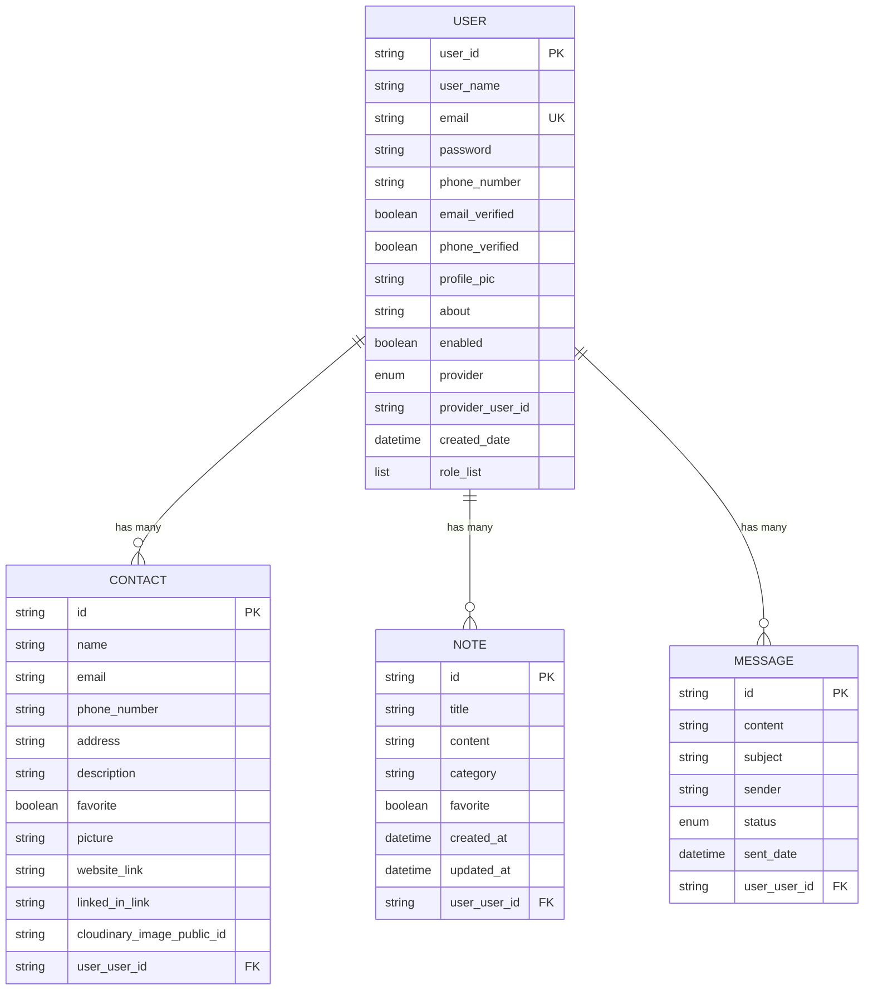

# Smart Contact Manager - Complete Project Documentation

## 📋 Table of Contents

1. [Project Overview](#project-overview)
2. [System Architecture](#system-architecture)
3. [Technology Stack](#technology-stack)
4. [Features & Implementation](#features--implementation)
5. [Dependencies & Libraries](#dependencies--libraries)
6. [Database Design](#database-design)
7. [API Documentation](#api-documentation)
8. [Security Implementation](#security-implementation)
9. [Frontend Components](#frontend-components)
10. [Setup & Installation](#setup--installation)
11. [Development Guidelines](#development-guidelines)
12. [Deployment Instructions](#deployment-instructions)

---

## 🎯 Project Overview

**Smart Contact Manager** is a full-stack web application designed for comprehensive contact management with advanced features like note-taking, bulk operations, and multi-provider authentication. The application provides a modern, responsive interface for users to manage their contacts efficiently.

### **Project Goals**
- Secure user authentication with multiple providers
- Efficient contact management with CRUD operations
- Advanced note-taking capabilities
- Bulk contact import/export via Excel
- Responsive and intuitive user interface
- RESTful API architecture

### **Target Users**
- Individuals managing personal contacts
- Small businesses organizing customer information
- Professionals requiring contact categorization
- Users needing bulk contact operations

---

## 🏗️ System Architecture

### **Architecture Pattern: Three-Tier Architecture**

```
┌─────────────────────────────────────────────────────────┐
│                 PRESENTATION LAYER                       │
│  React.js Frontend (Port 5173) + Vite Build Tool       │
│  - Components, Pages, Contexts, Routing                │
│  - Responsive UI with Tailwind CSS                     │
│  - State Management with React Hooks                   │
└─────────────────────────────────────────────────────────┘
                              │
                              ▼
┌─────────────────────────────────────────────────────────┐
│                  BUSINESS LAYER                         │
│  Spring Boot Backend (Port 8081)                       │
│  - REST API Controllers                                 │
│  - Service Layer Business Logic                        │
│  - JWT Authentication & Security                       │
│  - Excel Processing & Email Services                   │
└─────────────────────────────────────────────────────────┘
                              │
                              ▼
┌─────────────────────────────────────────────────────────┐
│                   DATA LAYER                            │
│  MySQL Database (Port 3306)                            │
│  - JPA/Hibernate ORM                                   │
│  - Entity Relationships                                │
│  - Data Persistence & Transactions                     │
└─────────────────────────────────────────────────────────┘
```

---

## 💻 Technology Stack

### **Backend Technologies**

| Technology | Version | Purpose |
|------------|---------|---------|
| **Java** | 21+ | Core programming language |
| **Spring Boot** | 3.2.10 | Application framework |
| **Spring Security** | 6.x | Authentication & authorization |
| **Spring Data JPA** | 3.x | Data persistence layer |
| **Hibernate** | 6.4.10 | ORM framework |
| **MySQL** | 8.0+ | Relational database |
| **Maven** | 3.6+ | Build automation & dependency management |

### **Frontend Technologies**

| Technology | Version | Purpose |
|------------|---------|---------|
| **React.js** | 18.x | Frontend framework |
| **Vite** | 7.0.6 | Build tool & development server |
| **React Router** | 6.x | Client-side routing |
| **Axios** | Latest | HTTP client for API calls |
| **Tailwind CSS** | 3.x | Utility-first CSS framework |
| **JavaScript (ES6+)** | ES2023 | Programming language |

### **Additional Libraries & Tools**

| Technology | Purpose | Implementation Area |
|------------|---------|-------------------|
| **Apache POI** | Excel file processing | Backend - Import/Export |
| **JWT (JSON Web Tokens)** | Stateless authentication | Backend - Security |
| **React Toastify** | Notification system | Frontend - User feedback |
| **Font Awesome** | Icon library | Frontend - UI components |
| **Lombok** | Code reduction | Backend - Entity classes |
| **Cloudinary** | Image hosting | Backend - File storage |
| **OAuth2** | Social authentication | Backend - Third-party login |

---

## 🚀 Features & Implementation

### **1. Authentication & Authorization**

#### **Features:**
- ✅ Multi-provider authentication (Local, Google, GitHub)
- ✅ JWT-based stateless authentication
- ✅ Email verification system
- ✅ Password reset functionality
- ✅ OAuth2 integration
- ✅ Role-based access control

#### **Implementation Details:**

**Technologies Used:**
- Spring Security 6.x
- JWT (JSON Web Tokens)
- OAuth2 Client
- JavaMail API

**Key Components:**
```java
// JWT Authentication Filter
@Component
public class JwtAuthenticationFilter extends OncePerRequestFilter {
    // JWT token validation and user authentication
}

// OAuth2 Success Handler
@Component
public class OAuth2AuthenticationSuccessHandler implements AuthenticationSuccessHandler {
    // Handle successful OAuth2 authentication
}

// Security Configuration
@Configuration
@EnableWebSecurity
public class SecurityConfig {
    // Configure security filters, CORS, and authentication providers
}
```

**API Endpoints:**
- `POST /api/auth/login` - User login
- `POST /api/auth/validate` - Token validation
- `GET /oauth2/authorization/{provider}` - OAuth2 login
- `POST /auth/logout` - User logout

---

### **2. Contact Management System**

#### **Features:**
- ✅ CRUD operations for contacts
- ✅ Contact categorization and favoriting
- ✅ Profile picture upload with Cloudinary
- ✅ Advanced search and filtering
- ✅ Pagination for large datasets
- ✅ Contact validation and duplicate detection

#### **Implementation Details:**

**Technologies Used:**
- Spring Data JPA
- Hibernate ORM
- Cloudinary API
- Bean Validation

**Entity Structure:**
```java
@Entity
@Table(name = "contact")
public class Contact {
    @Id
    private String id;
    
    @NotBlank(message = "Name is required")
    private String name;
    
    @Email(message = "Invalid email format")
    private String email;
    
    @ManyToOne
    @JsonIgnore
    private User user;
    
    // Additional fields...
}
```

**Key Features:**
- Image upload with validation
- Contact sharing capabilities
- Bulk operations support
- Advanced search with keywords

---

### **3. Notes Management System**

#### **Features:**
- ✅ Create, read, update, delete notes
- ✅ Note categorization
- ✅ Favorite notes functionality
- ✅ Full-text search in notes
- ✅ Rich text content support
- ✅ Pagination and sorting

#### **Implementation Details:**

**Technologies Used:**
- Spring Data JPA
- Custom repository queries
- React state management

**Entity Structure:**
```java
@Entity
public class Note {
    @Id
    private String id;
    
    @NotBlank(message = "Title is required")
    @Size(min = 3, max = 200)
    private String title;
    
    @NotBlank(message = "Content is required")
    @Size(min = 5, max = 5000)
    private String content;
    
    private String category;
    private boolean favorite = false;
    
    @CreationTimestamp
    private LocalDateTime createdAt;
    
    @UpdateTimestamp
    private LocalDateTime updatedAt;
    
    @ManyToOne
    @JsonIgnore
    private User user;
}
```

**API Endpoints:**
- `GET /api/notes` - Get paginated notes
- `POST /user/notes/add` - Create new note
- `POST /user/notes/edit/{id}` - Update note
- `DELETE /user/notes/{id}` - Delete note
- `PUT /user/notes/{id}/favorite` - Toggle favorite

---

### **4. Excel Import/Export System**

#### **Features:**
- ✅ Bulk contact import from Excel files
- ✅ Excel template generation
- ✅ Data validation during import
- ✅ Error reporting for failed imports
- ✅ Contact export to Excel format
- ✅ Selective export (all contacts or favorites only)

#### **Implementation Details:**

**Technologies Used:**
- Apache POI 5.2.4
- Multipart file handling
- Data validation frameworks

**Key Components:**
```java
@Service
public class ExcelServiceImpl implements ExcelService {
    
    @Override
    public List<Contact> importContactsFromExcel(MultipartFile file, User user) {
        // Excel file processing with validation
        // Row-by-row contact creation
        // Error collection and reporting
    }
    
    @Override
    public byte[] exportContactsToExcel(List<Contact> contacts) {
        // Excel file generation with styling
        // Contact data formatting
        // Template creation
    }
}
```

**Supported Operations:**
- Template download with sample data
- File format validation (.xlsx, .xls)
- Duplicate detection during import
- Batch processing with error handling
- Export with custom formatting

---

### **5. User Profile Management**

#### **Features:**
- ✅ View comprehensive user profile
- ✅ Edit personal information
- ✅ Profile picture management
- ✅ Account verification status
- ✅ Provider information display
- ✅ Account statistics

#### **Implementation Details:**

**Technologies Used:**
- React hooks for state management
- Form validation
- RESTful API integration

**Profile Update API:**
```java
@RestController
@RequestMapping("/api/user")
public class UserApiController {
    
    @PutMapping("/profile")
    public ResponseEntity<User> updateUserProfile(@Valid @RequestBody UpdateUserRequest request) {
        // Profile update with validation
        // User data persistence
        // Response formatting
    }
}
```

**Features:**
- Real-time form validation
- Image URL validation
- Success/error notifications
- Responsive design

---

## 📦 Dependencies & Libraries

### **Backend Dependencies (Maven - pom.xml)**

#### **Core Spring Dependencies**
```xml
<!-- Spring Boot Starter -->
<dependency>
    <groupId>org.springframework.boot</groupId>
    <artifactId>spring-boot-starter-web</artifactId>
    <version>3.2.10</version>
</dependency>

<!-- Spring Security -->
<dependency>
    <groupId>org.springframework.boot</groupId>
    <artifactId>spring-boot-starter-security</artifactId>
    <version>3.2.10</version>
</dependency>

<!-- Spring Data JPA -->
<dependency>
    <groupId>org.springframework.boot</groupId>
    <artifactId>spring-boot-starter-data-jpa</artifactId>
    <version>3.2.10</version>
</dependency>

<!-- OAuth2 Client -->
<dependency>
    <groupId>org.springframework.boot</groupId>
    <artifactId>spring-boot-starter-oauth2-client</artifactId>
    <version>3.2.10</version>
</dependency>
```

#### **Database & ORM**
```xml
<!-- MySQL Connector -->
<dependency>
    <groupId>mysql</groupId>
    <artifactId>mysql-connector-java</artifactId>
    <version>8.0.33</version>
</dependency>

<!-- Hibernate Validator -->
<dependency>
    <groupId>org.springframework.boot</groupId>
    <artifactId>spring-boot-starter-validation</artifactId>
    <version>3.2.10</version>
</dependency>
```

#### **Utility Libraries**
```xml
<!-- Lombok -->
<dependency>
    <groupId>org.projectlombok</groupId>
    <artifactId>lombok</artifactId>
    <version>1.18.30</version>
</dependency>

<!-- Apache POI for Excel -->
<dependency>
    <groupId>org.apache.poi</groupId>
    <artifactId>poi</artifactId>
    <version>5.2.4</version>
</dependency>

<dependency>
    <groupId>org.apache.poi</groupId>
    <artifactId>poi-ooxml</artifactId>
    <version>5.2.4</version>
</dependency>

<!-- JWT -->
<dependency>
    <groupId>io.jsonwebtoken</groupId>
    <artifactId>jjwt-api</artifactId>
    <version>0.12.3</version>
</dependency>

<!-- Cloudinary -->
<dependency>
    <groupId>com.cloudinary</groupId>
    <artifactId>cloudinary-http44</artifactId>
    <version>1.37.0</version>
</dependency>

<!-- Email -->
<dependency>
    <groupId>org.springframework.boot</groupId>
    <artifactId>spring-boot-starter-mail</artifactId>
    <version>3.2.10</version>
</dependency>
```

### **Frontend Dependencies (package.json)**

#### **Core React Dependencies**
```json
{
  "dependencies": {
    "react": "^18.2.0",
    "react-dom": "^18.2.0",
    "react-router-dom": "^6.15.0",
    "axios": "^1.5.0",
    "react-toastify": "^9.1.3"
  },
  "devDependencies": {
    "@vitejs/plugin-react": "^4.0.3",
    "vite": "^7.0.6",
    "tailwindcss": "^3.3.0",
    "autoprefixer": "^10.4.14",
    "postcss": "^8.4.27",
    "eslint": "^8.45.0"
  }
}
```

#### **CSS & UI Libraries**
```json
{
  "dependencies": {
    "tailwindcss": "^3.3.0",
    "@heroicons/react": "^2.0.18"
  }
}
```

**External CDN Libraries:**
- Font Awesome 6.4.0 (Icons)
- Google Fonts (Typography)

---

## 🗄️ Database Design

### **Entity Relationship Diagram**



### **Database Schema Details**

#### **User Entity**
- **Primary Key**: UUID-based user_id
- **Unique Constraints**: email
- **Relationships**: One-to-Many with Contact, Note, Message
- **Indexes**: email, provider, enabled status

#### **Contact Entity**
- **Primary Key**: UUID-based id
- **Foreign Key**: user_user_id (references User)
- **Validation**: Email format, phone number length
- **Features**: Soft delete capability, image storage

#### **Note Entity**
- **Primary Key**: UUID-based id
- **Foreign Key**: user_user_id (references User)
- **Timestamps**: Automatic creation and update tracking
- **Features**: Full-text search capability, categorization

---

## 🔌 API Documentation

### **Authentication Endpoints**

| Method | Endpoint | Description | Request Body | Response |
|--------|----------|-------------|--------------|----------|
| POST | `/api/auth/login` | User login | `{email, password}` | JWT token |
| POST | `/api/auth/validate` | Validate JWT token | `{token}` | User info |
| GET | `/oauth2/authorization/google` | Google OAuth login | - | Redirect |
| GET | `/oauth2/authorization/github` | GitHub OAuth login | - | Redirect |

### **Contact Management Endpoints**

| Method | Endpoint | Description | Parameters | Response |
|--------|----------|-------------|------------|----------|
| GET | `/user/contacts` | Get paginated contacts | `page, size, sortBy` | Contact list |
| POST | `/user/contacts/add` | Create new contact | Contact object | Created contact |
| GET | `/user/contacts/{id}` | Get contact by ID | Contact ID | Contact details |
| PUT | `/user/contacts/update/{id}` | Update contact | Contact ID, data | Updated contact |
| DELETE | `/user/contacts/delete/{id}` | Delete contact | Contact ID | Success message |

### **Notes Management Endpoints**

| Method | Endpoint | Description | Parameters | Response |
|--------|----------|-------------|------------|----------|
| GET | `/api/notes` | Get paginated notes | `page, size, keyword` | Notes list |
| POST | `/user/notes/add` | Create new note | Note object | Created note |
| POST | `/user/notes/edit/{id}` | Update note | Note ID, data | Updated note |
| DELETE | `/user/notes/{id}` | Delete note | Note ID | Success message |
| PUT | `/user/notes/{id}/favorite` | Toggle favorite | Note ID | Updated note |

### **Excel Operations Endpoints**

| Method | Endpoint | Description | Parameters | Response |
|--------|----------|-------------|------------|----------|
| GET | `/api/excel/template` | Download Excel template | - | Excel file |
| POST | `/api/excel/import` | Import contacts from Excel | Excel file | Import results |
| GET | `/api/excel/export` | Export contacts to Excel | `favorites` | Excel file |
| GET | `/api/excel/stats` | Get contact statistics | - | Statistics data |

### **User Profile Endpoints**

| Method | Endpoint | Description | Request Body | Response |
|--------|----------|-------------|--------------|----------|
| GET | `/api/user/profile` | Get user profile | - | User data |
| PUT | `/api/user/profile` | Update user profile | User update data | Updated user |

---

## 🔒 Security Implementation

### **Authentication Strategy**

#### **JWT (JSON Web Tokens)**
```java
@Component
public class JwtUtil {
    
    public String generateToken(String username) {
        return Jwts.builder()
            .setSubject(username)
            .setIssuedAt(new Date())
            .setExpiration(new Date(System.currentTimeMillis() + JWT_EXPIRATION))
            .signWith(secretKey)
            .compact();
    }
    
    public boolean validateToken(String token) {
        // Token validation logic
    }
}
```

#### **OAuth2 Integration**
```properties
# Google OAuth2
spring.security.oauth2.client.registration.google.client-id=${GOOGLE_CLIENT_ID}
spring.security.oauth2.client.registration.google.client-secret=${GOOGLE_CLIENT_SECRET}

# GitHub OAuth2
spring.security.oauth2.client.registration.github.client-id=${GITHUB_CLIENT_ID}
spring.security.oauth2.client.registration.github.client-secret=${GITHUB_CLIENT_SECRET}
```

### **Security Features**

1. **Password Encryption**: BCrypt hashing
2. **CORS Configuration**: Restricted origins
3. **CSRF Protection**: Disabled for stateless APIs
4. **Input Validation**: Bean validation annotations
5. **SQL Injection Prevention**: JPA parameterized queries
6. **XSS Protection**: Content Security Policy headers

### **Access Control**

```java
@EnableGlobalMethodSecurity(prePostEnabled = true)
public class SecurityConfig {
    
    @Bean
    public SecurityFilterChain filterChain(HttpSecurity http) throws Exception {
        return http
            .authorizeHttpRequests(auth -> auth
                .requestMatchers("/api/auth/**").permitAll()
                .requestMatchers("/user/**").authenticated()
                .anyRequest().authenticated()
            )
            .build();
    }
}
```

---

## 🎨 Frontend Components

### **Component Architecture**

```
src/
├── components/
│   ├── common/
│   │   ├── Footer.jsx
│   │   ├── MessageBox.jsx
│   │   ├── Navbar.jsx
│   │   └── PrivateRoute.jsx
│   └── user/
│       ├── ContactModal.jsx
│       ├── UserNavbar.jsx
│       └── UserSidebar.jsx
├── contexts/
│   ├── AuthContext.jsx
│   └── ThemeContext.jsx
├── pages/
│   ├── auth/
│   │   ├── LoginPage.jsx
│   │   ├── RegisterPage.jsx
│   │   ├── VerifyEmailPage.jsx
│   │   └── OAuthSuccessPage.jsx
│   ├── user/
│   │   ├── DashboardPage.jsx
│   │   ├── ContactsPage.jsx
│   │   ├── AddContactPage.jsx
│   │   ├── UpdateContactPage.jsx
│   │   ├── ProfilePage.jsx
│   │   ├── NotesPage.jsx
│   │   ├── AddEditNotePage.jsx
│   │   └── ExcelPage.jsx
│   └── public/
│       ├── HomePage.jsx
│       ├── AboutPage.jsx
│       ├── ServicesPage.jsx
│       └── ContactPage.jsx
└── api/
    └── axiosConfig.js
```

### **Key React Features Used**

#### **Hooks Implementation**
```jsx
// Custom authentication hook
const useAuth = () => {
    const context = useContext(AuthContext);
    if (context === null) {
        throw new Error('useAuth must be used within an AuthProvider');
    }
    return context;
};

// State management in components
const [contacts, setContacts] = useState([]);
const [loading, setLoading] = useState(true);
const [error, setError] = useState('');
```

#### **Context API for State Management**
```jsx
const AuthContext = createContext(null);

const AuthProvider = ({ children }) => {
    const [isAuthenticated, setIsAuthenticated] = useState(false);
    const [user, setUser] = useState(null);
    
    // Authentication methods
    const login = async (credentials) => { /* ... */ };
    const logout = async () => { /* ... */ };
    
    return (
        <AuthContext.Provider value={{ isAuthenticated, user, login, logout }}>
            {children}
        </AuthContext.Provider>
    );
};
```

#### **Routing Configuration**
```jsx
const App = () => {
    return (
        <BrowserRouter>
            <Routes>
                {/* Public routes */}
                <Route path="/" element={<HomePage />} />
                <Route path="/login" element={<LoginPage />} />
                <Route path="/register" element={<RegisterPage />} />
                
                {/* Protected routes */}
                <Route element={<PrivateRoute />}>
                    <Route path="/user/dashboard" element={<DashboardPage />} />
                    <Route path="/user/contacts" element={<ContactsPage />} />
                    <Route path="/user/notes" element={<NotesPage />} />
                    <Route path="/user/profile" element={<ProfilePage />} />
                    <Route path="/user/excel" element={<ExcelPage />} />
                </Route>
            </Routes>
        </BrowserRouter>
    );
};
```

---

## ⚙️ Setup & Installation

### **Prerequisites**

#### **Backend Requirements**
- Java 21 or higher
- Maven 3.6+
- MySQL 8.0+
- IDE (IntelliJ IDEA / Eclipse / VS Code)

#### **Frontend Requirements**
- Node.js 18+
- npm 9+ or yarn
- Modern web browser

### **Backend Setup**

#### **1. Clone Repository**
```bash
git clone https://github.com/yourusername/smart-contact-manager.git
cd smart-contact-manager
```

#### **2. Database Configuration**
```sql
-- Create database
CREATE DATABASE scm2;

-- Create user (optional)
CREATE USER 'scm_user'@'localhost' IDENTIFIED BY 'password';
GRANT ALL PRIVILEGES ON scm2.* TO 'scm_user'@'localhost';
FLUSH PRIVILEGES;
```

#### **3. Application Configuration**
```properties
# Database Configuration
spring.datasource.url=jdbc:mysql://localhost:3306/scm2
spring.datasource.username=root
spring.datasource.password=admin
spring.jpa.hibernate.ddl-auto=update

# JWT Configuration
jwt.secret=your-secret-key
jwt.expiration=86400000

# OAuth2 Configuration
spring.security.oauth2.client.registration.google.client-id=your-google-client-id
spring.security.oauth2.client.registration.google.client-secret=your-google-client-secret

# Email Configuration
spring.mail.host=smtp.gmail.com
spring.mail.port=587
spring.mail.username=your-email@gmail.com
spring.mail.password=your-app-password

# Cloudinary Configuration
cloudinary.cloud.name=your-cloud-name
cloudinary.api.key=your-api-key
cloudinary.api.secret=your-api-secret
```

#### **4. Run Backend**
```bash
cd Smart-Contact-Manager
./mvnw spring-boot:run
```

### **Frontend Setup**

#### **1. Navigate to Frontend Directory**
```bash
cd frontend
```

#### **2. Install Dependencies**
```bash
npm install
```

#### **3. Environment Configuration**
```bash
# Create .env file
VITE_BACKEND_URL=http://localhost:8081
```

#### **4. Run Frontend**
```bash
npm run dev
```

### **Access Application**
- **Frontend**: http://localhost:5173
- **Backend**: http://localhost:8081
- **Database**: localhost:3306

---

## 📝 Development Guidelines

### **Backend Development Practices**

#### **1. Code Structure**
```
src/main/java/com/scm/
├── config/          # Configuration classes
├── controllers/     # REST controllers
│   └── api/        # API-specific controllers
├── entities/       # JPA entities
├── repositories/   # Data access layer
├── services/       # Business logic layer
│   └── impl/      # Service implementations
├── dto/           # Data transfer objects
├── helpers/       # Utility classes
└── forms/         # Form validation classes
```

#### **2. Naming Conventions**
- **Classes**: PascalCase (e.g., `UserService`, `ContactController`)
- **Methods**: camelCase (e.g., `getUserById`, `saveContact`)
- **Variables**: camelCase (e.g., `userName`, `contactList`)
- **Constants**: UPPER_SNAKE_CASE (e.g., `JWT_EXPIRATION`)

#### **3. Exception Handling**
```java
@ControllerAdvice
public class GlobalExceptionHandler {
    
    @ExceptionHandler(EntityNotFoundException.class)
    public ResponseEntity<ErrorResponse> handleNotFound(EntityNotFoundException ex) {
        return ResponseEntity.notFound().build();
    }
    
    @ExceptionHandler(ValidationException.class)
    public ResponseEntity<ErrorResponse> handleValidation(ValidationException ex) {
        return ResponseEntity.badRequest().body(new ErrorResponse(ex.getMessage()));
    }
}
```

### **Frontend Development Practices**

#### **1. Component Structure**
```jsx
// Functional component with hooks
const ComponentName = ({ prop1, prop2 }) => {
    // State declarations
    const [state, setState] = useState(initialValue);
    
    // Effect hooks
    useEffect(() => {
        // Side effects
    }, [dependencies]);
    
    // Event handlers
    const handleEvent = () => {
        // Event handling logic
    };
    
    // Render
    return (
        <div className="component-container">
            {/* JSX content */}
        </div>
    );
};

export default ComponentName;
```

#### **2. State Management**
```jsx
// Use Context for global state
const GlobalContext = createContext();

// Use useState for local component state
const [localState, setLocalState] = useState(initialValue);

// Use useReducer for complex state logic
const [state, dispatch] = useReducer(reducer, initialState);
```

#### **3. API Integration**
```jsx
// Centralized API configuration
const axiosInstance = axios.create({
    baseURL: process.env.VITE_BACKEND_URL,
    headers: {
        'Content-Type': 'application/json',
    },
});

// Request interceptor for authentication
axiosInstance.interceptors.request.use((config) => {
    const token = localStorage.getItem('token');
    if (token) {
        config.headers.Authorization = `Bearer ${token}`;
    }
    return config;
});
```

---

## 🚀 Deployment Instructions

### **Production Build**

#### **1. Frontend Build**
```bash
cd frontend
npm run build
```

#### **2. Backend Build**
```bash
cd Smart-Contact-Manager
./mvnw clean package -DskipTests
```

### **Deployment Options**

#### **1. Traditional Server Deployment**
```bash
# Copy JAR file to server
scp target/smart-contact-manager.jar user@server:/path/to/app/

# Run application
java -jar smart-contact-manager.jar --spring.profiles.active=prod
```

#### **2. Docker Deployment**
```dockerfile
# Dockerfile for backend
FROM openjdk:21-jdk-slim
COPY target/smart-contact-manager.jar app.jar
EXPOSE 8081
ENTRYPOINT ["java", "-jar", "/app.jar"]
```

```dockerfile
# Dockerfile for frontend
FROM nginx:alpine
COPY dist/ /usr/share/nginx/html/
EXPOSE 80
```

#### **3. Cloud Deployment (Heroku)**
```bash
# Install Heroku CLI
heroku create smart-contact-manager

# Set environment variables
heroku config:set SPRING_PROFILES_ACTIVE=prod
heroku config:set DATABASE_URL=your-database-url

# Deploy
git push heroku main
```

### **Environment Variables**

#### **Production Configuration**
```properties
# Database
SPRING_DATASOURCE_URL=jdbc:mysql://production-db:3306/scm
SPRING_DATASOURCE_USERNAME=${DB_USERNAME}
SPRING_DATASOURCE_PASSWORD=${DB_PASSWORD}

# Security
JWT_SECRET=${JWT_SECRET}
GOOGLE_CLIENT_ID=${GOOGLE_CLIENT_ID}
GOOGLE_CLIENT_SECRET=${GOOGLE_CLIENT_SECRET}

# Email
SPRING_MAIL_USERNAME=${EMAIL_USERNAME}
SPRING_MAIL_PASSWORD=${EMAIL_PASSWORD}

# Cloudinary
CLOUDINARY_CLOUD_NAME=${CLOUDINARY_CLOUD_NAME}
CLOUDINARY_API_KEY=${CLOUDINARY_API_KEY}
CLOUDINARY_API_SECRET=${CLOUDINARY_API_SECRET}
```

---

## 📊 Project Statistics

### **Codebase Metrics**

| Component | Files | Lines of Code | Key Features |
|-----------|-------|---------------|--------------|
| **Backend** | ~70 files | ~8,000 LOC | REST APIs, Security, Services |
| **Frontend** | ~25 files | ~3,500 LOC | React Components, Routing |
| **Database** | 4 tables | - | JPA Entities, Relationships |
| **Configuration** | ~10 files | ~500 LOC | Security, CORS, Database |

### **Feature Coverage**

| Feature Category | Implementation Status | Complexity Level |
|------------------|---------------------|------------------|
| **Authentication** | ✅ Complete | High |
| **Contact Management** | ✅ Complete | Medium |
| **Notes System** | ✅ Complete | Medium |
| **Excel Operations** | ✅ Complete | High |
| **User Profile** | ✅ Complete | Low |
| **Responsive UI** | ✅ Complete | Medium |

---

## 🔄 Future Enhancements

### **Planned Features**
1. **Real-time notifications** using WebSocket
2. **Advanced search** with Elasticsearch
3. **Mobile application** using React Native
4. **API rate limiting** and throttling
5. **Multi-language support** (i18n)
6. **Dark mode** implementation
7. **Contact sharing** between users
8. **Calendar integration** for contact events
9. **Advanced reporting** and analytics
10. **Backup and restore** functionality

### **Technical Improvements**
1. **Microservices architecture** migration
2. **Redis caching** implementation
3. **Docker containerization**
4. **CI/CD pipeline** setup
5. **Unit and integration testing** expansion
6. **Performance monitoring** with Micrometer
7. **API documentation** with Swagger/OpenAPI
8. **Database optimization** and indexing

---

## 📞 Support & Contact

### **Documentation**
- **GitHub Repository**: [Smart Contact Manager](https://github.com/akshay75760/Smart-Contact-Manager)
- **API Documentation**: Available at `/swagger-ui.html` (when implemented)
- **User Guide**: Included in the application

### **Technical Support**
- **Issues**: Report bugs and feature requests on GitHub Issues
- **Development**: Follow the development guidelines for contributions
- **Community**: Join our developer community for discussions

---

**© 2025 Smart Contact Manager - All Rights Reserved**

*This documentation covers the complete implementation of the Smart Contact Manager project, including all technologies, features, and deployment procedures. For the most up-to-date information, please refer to the GitHub repository.*
